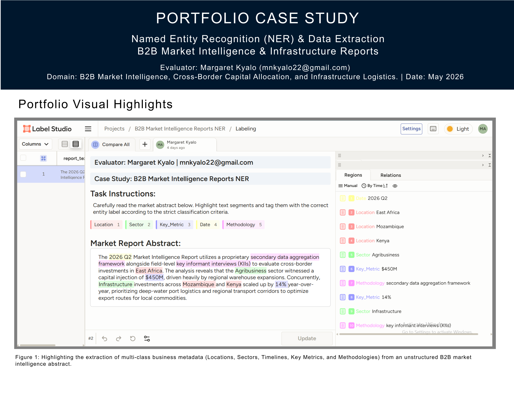

# B2B Market Intelligence Reports: Named Entity Recognition (NER) & Data Extraction

[-purple)](#)

## Overview
This case study demonstrates the structuring and token-level annotation of dense, unstructured B2B macroeconomic reports. By converting free-form abstracts into structured metadata matrices, this pipeline provides high-fidelity training data to optimize downstream Natural Language Processing (NLP) models and Large Language Model (LLM) extraction layers.

---

## Technical Project Specs
* **Evaluator:** Margaret Kyalo
* **Task Type:** Named Entity Recognition (NER), Custom Span Annotation, and Token Classification
* **Domain:** B2B Market Intelligence, Cross-Border Capital Allocation, and Infrastructure Logistics
* **Primary Objective:** Standardize structural metadata extraction from unstructured market analysis assets to accelerate automated ingestion into business intelligence platforms.

---

## Entity Taxonomy
Annotations were completed following strict multi-class token classification guidelines to isolate key domain-specific information:

| Entity Label | Classification Scope & Description | Examples |
| :--- | :--- | :--- |
| **`Location`** | Sovereign states, geographic zones, and cross-border economic trade blocs. | `East Africa`, `Mozambique`, `Kenya` |
| **`Sector`** | Primary industrial markets and macroeconomic verticals subject to capital tracking. | `Agribusiness`, `Infrastructure` |
| **`Key_Metric`** | Quantitative project thresholds, volume scales, and capital allocation values. | `$450M`, `14%` |
| **`Date`** | Temporal parameters, seasonal reporting windows, and fiscal periods. | `2026 Q2` |
| **`Methodology`** | Data curation modalities and research methodologies utilized to build the report. | `secondary data aggregation framework`, `key informant interviews (KIIs)` |

---

## Sample Text & Annotation Workspace

### Target Report Abstract
> "The **2026 Q2** `[Date]` Market Intelligence Report utilizes a proprietary **secondary data aggregation framework** `[Methodology]` alongside field-level **key informant interviews (KIIs)** `[Methodology]` to evaluate cross-border investments in **East Africa** `[Location]`. The analysis reveals that the **Agribusiness** `[Sector]` sector witnessed a capital injection of **$450M** `[Key_Metric]`, driven heavily by regional warehouse expansions. Concurrently, **Infrastructure** `[Sector]` investments across **Mozambique** `[Location]` and **Kenya** `[Location]` scaled up by **14%** `[Key_Metric]` year-over-year..."

### Annotation Workspace (Label Studio)

*Figure 1: Custom Label Studio UI showcasing multi-class token span classification and entity extraction across the target text abstract.*

  

---

## Evaluation Focus & Data Quality
* **Span Annotation Density:** Evaluated complex text layers to capture nested operational entities without sacrificing character-level boundary precision.
* **Strict Classification Compliance:** Maintained exact character alignment across multi-word spans (e.g., full research methodology strings) to eliminate token bleeding during model ingestion.
* **Schema Uniformity:** Validated token classes against downstream JSON output specs to guarantee direct alignment between human-annotated UI layers and database schemas.

---

## Business Impact
Converting unstructured macroeconomic reporting into clean, token-classified metadata matrices enables automated market monitoring engines to accurately track sector growth vectors, cross-border capital inflows, and supply chain shifts with zero loss in data resolution.
